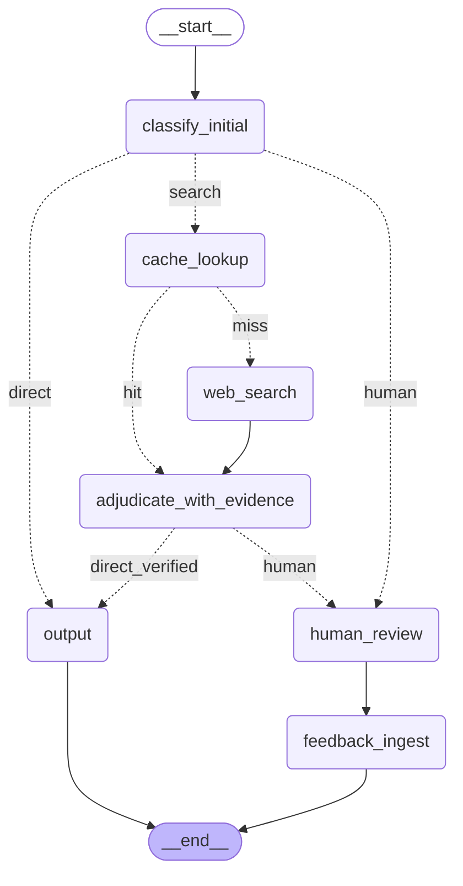
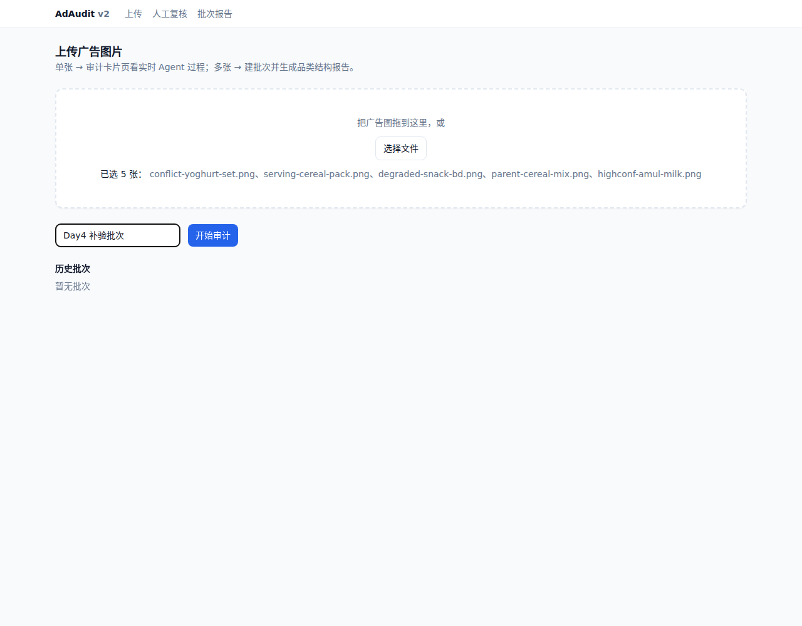
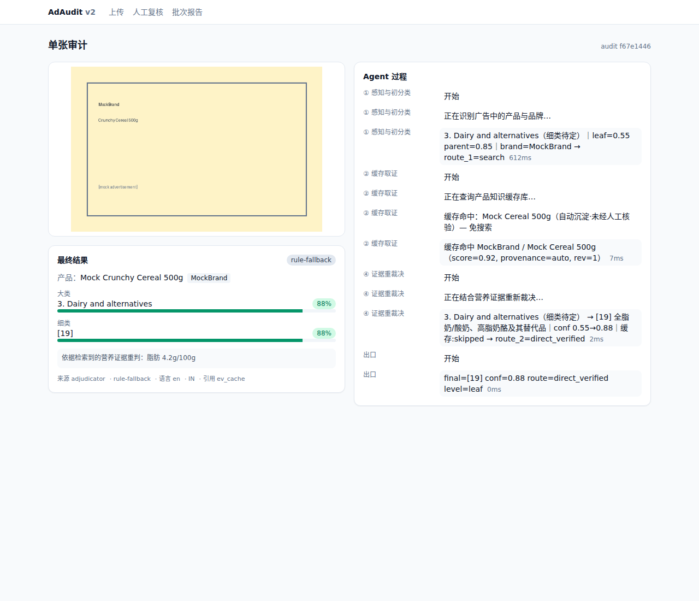
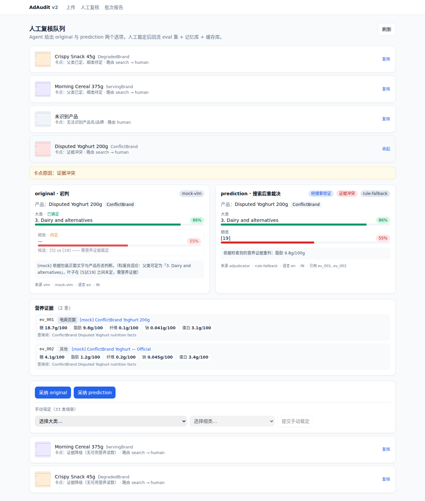
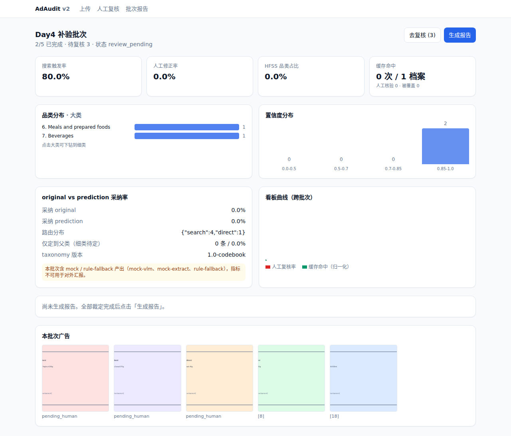
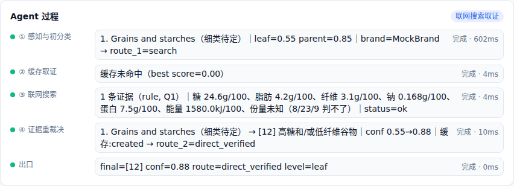

# AdAudit v2 · 置信度感知的食品广告品类审计 Agent

把「focus on category，置信度感知分析系统」升级成 **Agent + Web 应用**，实现全链路闭环：

> 上传广告 → 品类识别（12 大类 / 33 细类）→ 低置信 Agent 联网取证重裁决 →
> 高置信直出 / 低置信人工复核（双选项 original vs prediction）→ 人工结果回流 →
> 批次品类结构分析报告

---

## 架构

```
┌──────────────────────────┐        ┌────────────────────────────────────┐
│  Next.js (App Router)    │  REST  │  FastAPI                           │
│  localhost:3000          │◀──────▶│  ├─ /api/audits      审计 CRUD     │
│  4 页 + SSE 客户端        │  SSE   │  ├─ /api/audits/:id/stream  流式   │
└──────────────────────────┘◀──────▶│  ├─ /api/review      人工复核      │
                                    │  ├─ /api/batches     批次与报告    │
                                    │  └─ graph/  LangGraph 状态机       │
                                    │       ├─ SQLite checkpointer       │
                                    │       ├─ 产品缓存库（向量+SQLite）  │
                                    │       └─ MCP 联网搜索工具（W4）     │
                                    └────────────────────────────────────┘
```

LangGraph 状态机（`GET /api/graph` 可实时导出这张图）：



**结构性设计**：两个条件边把一张图切成**快路径**（VLM 一次调用直出，保吞吐与成本）和
**慢路径**（取证 + 可能人工，保难点样本准确率）。主干无环 —— 这不是 ReAct 式循环 Agent，
而是**有向无环状态机**，每次执行路径由数据决定。

---

## 系统界面

### 上传广告图片

支持拖拽 / 多选上传：单张进入审计卡片页实时查看 Agent 过程，多张自动建批次。



### 单张审计 · Agent 实时过程

左侧为广告图与最终结果（含置信度条），右侧通过 SSE 实时渲染 Agent 每个节点的
开始 / 日志 / 结束，缓存命中、联网搜索、证据重裁决全程可见。



### 人工复核队列

Agent 给出 **original（初判）** 与 **prediction（搜索后重裁决）** 双选项，
并附上检索到的营养证据；人工可一键采纳，或经 33 类级联选择器手动裁定，
裁定结果回流 eval 集、记忆库与缓存库。



### 批次报告与品类结构分析

批次级聚合看板：搜索触发率、人工修正率、HFSS 品类占比、缓存命中、
品类分布与置信度分布，全部裁定完成后可一键生成 LLM 报告。



### Agent 过程时间线

节点级耗时与摘要逐条落盘：初分类 → 缓存取证 → 联网搜索 → 证据重裁决 → 出口，
路由决策（`route_1` / `route_2`）显式可查。


